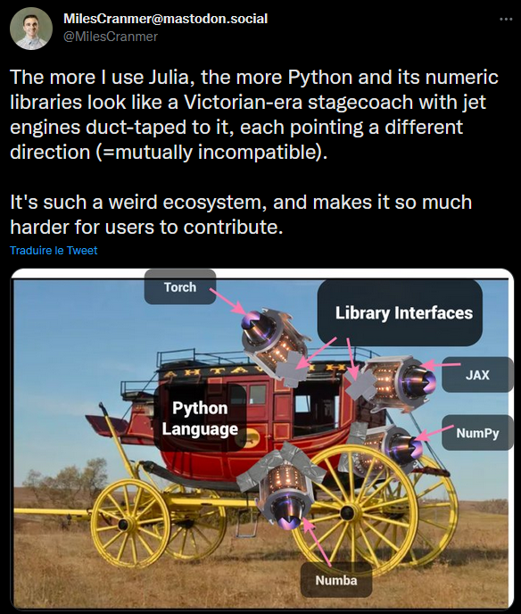

# [Collaborative Scientific computing](@id CollabSci)

## Personal view on Scientific computing

I like Gaël Varoquaux' (2010) blog post: [Personal views on scientific computing](https://gael-varoquaux.info/programming/view_on_scientific_computing.html).
He is leader of the `sklearn` package and this post does not mention Julia at all[^1].
I believe most of the stuff discussed (**TODO detail**) there are answered with Julia. Plus, Julia brings the performance factor into the discussion.

To go a step further, I believe that even if today's (2023) good open source practices are largely adopted most documentations and testing is limited.
Meaning that people put package into the wild $\Rightarrow$ users will make the effort for developers.

## Why Julia would be different?

So far, I observe that this is not the too much the case with Julia. Why though?

### One language

Python/R are high level languages, meaning they are easy to read and develop natively.
However, scientific applications are hard. At some point you need also performance.
That is where C++ and compiled low level language come in.
Most packages actually used are written in C++. Hence, you loose readability.
Ok for matrix multiplication and inverse where super optimized libraries (BLAS, LAPACK) do the job for you, you probably don't need to understand the source code.
For Machine learning?

Hence, plenty of "fast & readable" libraries have been developed, but they are all separated packages not so composable. I like this image about Python ecosystem.

How can, you contribute to packages written in C++?

1. Learn C++.
2. Or ask someone to translate your high level code into low level code. Then at each modification ask him again.

In Julia, you have one natively performant[^3], high level and expressive language to learn.
Then you can contribute to most packages. 
This is a very fruitful environment.

### Functional + multiple dispatch vs Object-Oriented Programming

TODO

### Package development

- Packages like `PkgTemplates.jl` are the standard for package creation, they create a `CI.yml` file and an associated `runtest.jl` file. Using the base package `Tests.jl` it is then super easy to write tests that are tested with GitHub actions. Versioning is also very easy.

- `Documenters.jl` package[^2] allows developing documentation very easily. The online deployment is also very easy (GitPage).

[^1]: Mainly because $2010<2012$. I don't know his current point of view on Julia.

[^2]: Plus friends like `LiveServer.jl`.

[^3]: People are sometime skeptical about that. Sure it might not be the most performant for every operation. However, it is of the order of magnitude of low level languages, which for scientific computing might be enough.
Sure if you are not an expert coder you might write kind of slow code. However, your code can be optimized within the same language (and learn better Julia in the process).
